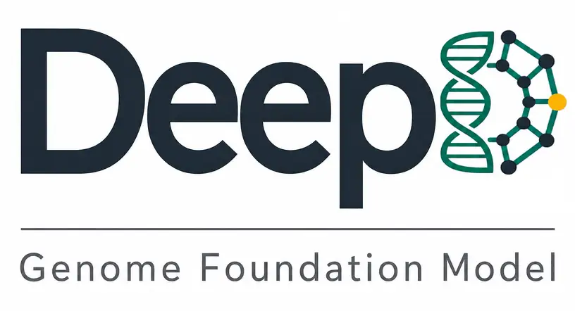
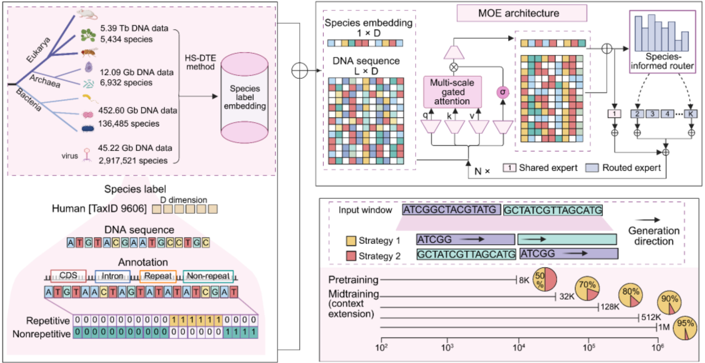

# DeepD: Phylogeny-Informed Genome Foundation Model and Controllable Long-Context Sequence Design



## Overview

**DeepD** is a sparse mixture-of-experts (MoE) genome foundation model for efficient long-context DNA modeling and generation. It operates at single-nucleotide resolution with a 1-million-token context window, while activating only a subset of experts for substantially reduced computation.

Pretrained on **5.69 Tb** unselected whole-genome sequences across all domains of life, DeepD learns genic and intergenic sequence features and supports broad sequence-to-function prediction across species. DeepD performs well in human protein fitness and disease variants effect prediction, such as *BRCA1* and *BRCA2*, with particular strength in regulatory regions, such as promoter and transcription-factor binding sites. 

The **Context–Anchor–Body** strategy of DeepD enables generation of coherent yeast chromosome sequences and megabase-scale *Arabidopsis* segments, that can hardly be distinguished from sequences of the natural yeast population. Together, DeepD is an efficient genome foundation model that unifies accurate sequence-to-function prediction with controllable genome-scale generation, advancing predictive and generative design of complex genomes.



## Repository contents

```text
deepd/
├── apiexample/          inference gateway client, CLI, and parameter reference
├── notebook/            zero-shot, generation, interpretability, synteny, and fine-tune demos
├── figure/              overview and architecture figures
└── requirements.txt
```


## Installation

```bash
git clone https://github.com/biomap-research/DeepD.git
cd deepd
pip install -r requirements.txt
```

Set an API token before calling the gateway:

```bash
export INFERENCE_API_TOKEN="your_api_token"
```

You can also place the token in the git-ignored `API-Key.txt` at the repository root, or pass `--token` on each command.

## Inference API

All DeepD features go through the `apiexample` gateway client (`apiexample/cli.py`). Each invocation submits a job, polls until it finishes, writes `{task_id}.json` to `--output-dir`, and prints a short task-type summary.


| Task        | Returns                                        |
| ----------- | ---------------------------------------------- |
| `embedding` | nucleotide-resolution sequence representation  |
| `logits`    | per-position logits, mean loss, and perplexity |
| `generate`  | DNA sequence conditioned on a prompt           |


```bash
cd apiexample

python cli.py --prompt ATGCATGC --task-type embedding \
  --species "Homo sapiens" --output-dir results
```

The [API usage guide](apiexample/README.md) covers configuration, worked examples, and the full parameter list.

## Notebooks


| Demo | Notebook | What it shows |
|---|---|---|
| Zero-shot | [`notebook/zero_shot/coding_auroc.ipynb`](notebook/zero_shot/coding_auroc.ipynb) | ClinVar coding SNVs scored from mutant vs. wild-type log-likelihood |
| Generation | [`notebook/generation/sequence_generation.ipynb`](notebook/generation/sequence_generation.ipynb) | Species-conditioned generation and GC-content check |
| Interpretability | [`notebook/interpretability/DeepD_HBB_best_layer_OVR_demo.ipynb`](notebook/interpretability/DeepD_HBB_best_layer_OVR_demo.ipynb) | HBB interval, best-layer one-vs-rest tracks — see [`notebook/interpretability/README.md`](notebook/interpretability/README.md) |
| Synteny | [`notebook/synteny/synteny_workflow.ipynb`](notebook/synteny/synteny_workflow.ipynb) | AIYeast00 vs. S288C chromosome III — see [`notebook/synteny/README.md`](notebook/synteny/README.md) |
| Fine-tune | [`notebook/fine_tune/gue_h3_embedding_classification.ipynb`](notebook/fine_tune/gue_h3_embedding_classification.ipynb) | GUE H3 classification on DeepD embeddings — see [`notebook/fine_tune/README.md`](notebook/fine_tune/README.md) |


Several notebooks download large runtime assets on first run. Use the README in each notebook directory for setup.